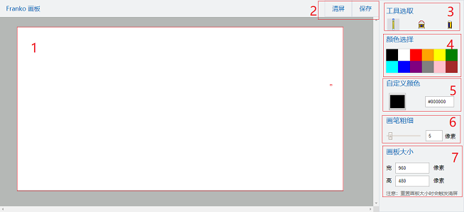

**随心所欲地涂鸦吧！**
## Franko 画板

### 一、项目介绍
此项目是使用原生 JS 实现的在线画板，只需打开页面，你直接就可以开始作画。在作画过程中，你可以自定义你的画笔颜色、粗细，以及画板的背景颜色、宽高等等。作画完成后可以一键保存画作，保证你能够便捷地记录下你一闪而过的创意。

这个项目是我之前开始学习 JavaScript 时的一个练手作品，现在重构了一遍，把样式和功能都进行了一些完善。虽然这个画板在功能上连 windows XP 上的画图的功能都比不上，但也基本上实现了一个画板应该具有的所有功能，主要包括刚才提到的自定义画笔、自定义画板、保存画作等功能。用到的技术包括：

* 原生 JS、CSS3、Canvas、iconfont、SVG

可以说是基础中的基础了，这就是我这个项目的预览链接：[http://franko.top/Franko-canvas](http://franko.top/Franko-canvas)。下面就在这里来讲解讲解这个简单的项目。

### 二、使用画板
打开项目页面，映入眼帘的就是整个画板的面板。没有其他前置操作，直接就可以开始使用。画板的所有功能也都一目了然：<div align=center></div>。

其中各个编号的区域分别具有以下功能：

1. 画板区域，直接使用鼠标在此作画。如果画板大小设置大于页面范围，可以通过拖动滚动条控制绘画区域；
2. 清除画板内容、保存画作的选项；
3. 绘画工具选取，包括铅笔、颜料桶、橡皮；
4. 提供了几种默认的颜色的选项；
5. 支持输入 16 进制颜色号及颜色选取的自定义颜色功能；
6. 改变画笔粗细的输入框；
7. 改变画板宽高的输入框；

总得来说，只要用过 window XP 里面的「画图」的人应该都比较清楚上面的这些概念。使用方式也非常简单，只要在画板上按下并拖动鼠标就可以在画板上划线了。不过，这里有两点与「画图」不同的地方需要注意：

* 颜料桶是真正意义上的「颜料桶」，会将选定的颜色「泼」到整个屏幕上
* 修改画板大小时会重置画板内容

了解了这些内容之后，关于这个作品的使用，我也应该没有专门写说明书出来的必要了，因为这用起来真的很简单。

### 三、总结
这一节就来讲讲这个画板的实现的具体操作。虽然这个画板用起来很简单，可是其中涉及的过程还是有一些学问的。这个项目的核心实际上就是 `<canvas>` 元素，`<canvas>` 是 HTML5 新增的元素，可用于通过使用JavaScript中的脚本来绘制图形，这个项目中的所有有关画板的操作无不与 Canvas API 相关联。

首先我们从最基础的划线开始讲起。每一条在画板的连线实际上都是由起点与终点的两个圆点与其之间的连线构成。但由于我们在画板上画的都不是直线，所以这里是通过监听鼠标移动事件（onmousemove），每监听到一次就渲染一个点，并记录前一个点，然后将两点连线。具体操作如下：
``` javascript
  canvas.onmousemove = function (event) {//移动鼠标
    var x = event.clientX
    var y = event.clientY
    if (!using) { return }  //如果「划线开关」为假

    if (eraserEnabled) {  //如果「橡皮开关」为真
      context.clearRect(x - 60 + scroll.x, y - 90 + scroll.y, 30, 30)
    } else {
      var newPoint = {  //当前点在画板上的位置，加上滚动条的滚动距离
        "x": x + scroll.x,
        "y": y + scroll.y
      }
      drawCircle(x + scroll.x, y + scroll.y, circleWidth)//画两端的圆
      drawLine(lastPoint.x, lastPoint.y, newPoint.x, newPoint.y)//连线
      lastPoint = newPoint//终点设为下个点的起点
    }
  }
```
这里面涉及到了两个操作：
* 因为只有鼠标按下时移动鼠标才会划线，所以鼠标按下（onmousedown）使「划线开关」为真；鼠标收起（onmouseup）或鼠标移出（onmouseout）画板范围时使之为假。
* 因为支持设定画板宽高，如果画板大于编辑框的大小，就要滚动到相应位置才能继续作画。所以这里要监听画板的滚动事件，才能使内容渲染在准确的位置。

关于颜色、画笔粗细、画板宽高的设置，这里都将输入框中的值与要设定的值做了绑定，监听输入框的 oninput 事件，在输入框的值改变时触发相应的 Canvas API 就可以了。

至于 Canvas API ，那几句话也说不清楚，这里就用到了画方、画圆、清除区域、填充颜色这几种吧，划线的宽度是由圆与方的宽度控制的。毕竟这个画板也没有什么高端操作，也没用到什么复杂的 API。关于这些 API 可以查阅 MDN 中的相关内容：[Canvas API | MDN](https://developer.mozilla.org/kab/docs/Web/API/Canvas_API)。

这个项目中最核心的地方应该就是原生 JS 中的事件监听的使用了吧，各种鼠标事件以及输入框事件。在最开始这个项目还在雏形阶段的时候是做了响应式的，因此还有触摸事件，但是现在因为偷懒的原因就没有做移动端了，主要是时间不够吧，本来也不是很难，就是些样式的问题。这是我的项目源码链接：[https://github.com/FanKaiqiang/Todo-List](https://github.com/FanKaiqiang/Todo-List)。